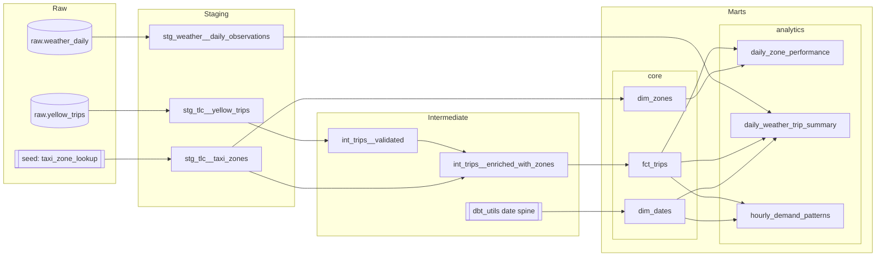

# NYC Taxi Analytics

A portfolio project demonstrating core analytics engineering practice: ingesting data from multiple public sources into a local warehouse, modeling it through a layered dbt lineage (staging, intermediate, marts), enforcing data quality with generic and singular tests, generating documentation, and running the whole pipeline in CI. The stack is intentionally lightweight (DuckDB as the warehouse, Python for ingestion, dbt for transformation) so the project can be cloned and run end to end with no external accounts, credentials, or paid services.

## Architecture



## Data sources

| Source | Type | Access | Lands as |
|---|---|---|---|
| NYC TLC yellow taxi trip records | Monthly parquet | Public CloudFront CDN, read remotely via DuckDB httpfs | `raw.yellow_trips` |
| Open-Meteo historical weather archive | JSON API | Public, no API key, Central Park NYC coordinates | `raw.weather_daily` |
| TLC taxi zone lookup | CSV | Committed dbt seed (`taxi_zone_lookup`) | `seeds.taxi_zone_lookup` |

## Project structure

```
.
├── ingestion/
│   └── load_raw_data.py          # loads raw.yellow_trips and raw.weather_daily
├── seeds/
│   └── taxi_zone_lookup.csv       # official TLC zone reference
├── models/
│   ├── staging/
│   │   ├── tlc/                   # stg_tlc__yellow_trips, stg_tlc__taxi_zones
│   │   └── weather/                # stg_weather__daily_observations
│   ├── intermediate/
│   │   ├── int_trips__validated.sql
│   │   └── int_trips__enriched_with_zones.sql
│   └── marts/
│       ├── core/                  # fct_trips, dim_zones, dim_dates
│       └── analytics/             # daily_zone_performance, daily_weather_trip_summary, hourly_demand_patterns
├── macros/
│   └── generate_schema_name.sql
├── tests/                          # singular tests
├── data/
│   └── nyc_taxi.duckdb             # local DuckDB warehouse (generated, gitignored)
├── dbt_project.yml
├── packages.yml
├── profiles.yml                    # committed: DuckDB local file, no secrets
├── requirements.txt
└── Makefile
```

## dbt layer conventions

- **Staging**: materialized as views. One staging model per source table, 1:1 with the source. Only renaming, casting, and light relabeling happens here, no joins, no business logic.
- **Intermediate**: materialized as views, split into two concerns:
  - *Validation* (`int_trips__validated`): quality filters, deduplication via `row_number` window functions, and surrogate key generation with `dbt_utils.generate_surrogate_key`.
  - *Enrichment* (`int_trips__enriched_with_zones`): joins to reference data (taxi zones) and derives calculated metrics.
- **Marts**: materialized as tables, split into two areas:
  - *Core*: the shared dimensional model (`fct_trips`, `dim_zones`, `dim_dates`) that downstream consumers build on.
  - *Analytics*: purpose-built aggregate tables (`daily_zone_performance`, `daily_weather_trip_summary`, `hourly_demand_patterns`) that answer specific analytical questions and reconcile back to core.

## Quickstart

```bash
# 1. Create and activate a virtual environment
python -m venv .venv
source .venv/bin/activate        # Windows: .venv\Scripts\activate

# 2. Install Python dependencies (dbt-duckdb, requests)
pip install -r requirements.txt

# 3. Load raw data (one quarter of TLC trips + matching weather)
python ingestion/load_raw_data.py --start-month 2025-01 --end-month 2025-03

# 4. Install dbt packages (dbt_utils)
dbt deps

# 5. Build and test every model
dbt build --profiles-dir .

# 6. Generate and browse documentation
dbt docs generate --profiles-dir .
dbt docs serve --profiles-dir .
```

`profiles.yml` is committed at the repo root because DuckDB is a local file database with no credentials to protect, so every `dbt` command above is run with `--profiles-dir .` instead of relying on a `~/.dbt/profiles.yml`.

## Testing strategy

- **Generic tests** applied through model YAML: `unique`, `not_null`, `accepted_values`, `relationships`, and `dbt_utils.unique_combination_of_columns` for composite grains (for example, zone plus date plus hour in `hourly_demand_patterns`).
- **Singular tests** for business rules that generic tests cannot express:
  - `assert_fct_trips_no_negative_amounts`: fares, tips, tolls, and totals in `fct_trips` are never negative.
  - `assert_daily_zone_performance_reconciles`: the aggregated trip count in `daily_zone_performance` reconciles to the underlying row count in `fct_trips`.

Run the full suite with `dbt build --profiles-dir .`, or tests only with `dbt test --profiles-dir .`.

## CI

A GitHub Actions workflow (`.github/workflows/ci.yml`) runs on every push to `main` and on every pull request. It installs dependencies, ingests one month of data, and runs `dbt build` end to end so the whole pipeline (ingestion, staging, intermediate, marts, and every test) is exercised on each change. On pushes to `main`, a second job publishes the generated dbt docs site to GitHub Pages.

To enable the docs deployment, set the repository's Pages source to **GitHub Actions** under Settings > Pages. Without that setting the `deploy-docs` job will fail even though the build itself succeeds.

## What this demonstrates

- **Layered modeling**: a clean staging, intermediate, marts separation with consistent materialization and naming conventions per layer.
- **Data quality testing**: generic and singular tests covering uniqueness, referential integrity, accepted values, and business-rule reconciliation between fact and aggregate tables.
- **Multi-source ingestion**: combining a remote parquet CDN, a public JSON API, and a static reference seed into one warehouse.
- **Idempotent pipelines**: ingestion uses `CREATE OR REPLACE` so re-running any load is safe and produces the same result.
- **Documentation**: full `dbt docs` generation including the lineage graph in this README, published automatically in CI.
- **Continuous integration**: every change is validated by building and testing the full project, not just linted.
